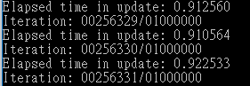

# CharlieYao1996-CVFX_StyleTransfer

  # 1.MUNIT training process 
  We use summer2winter dataset and we trained 300000 iterations.
   
  While we find that [260000](https://drive.google.com/open?id=1rNTlx2EP3eSrqZApuqMtahHxBug94vxM) iterations have the best performance.
   
  
  # 2.Inference cycleGAN in personal image
  >## situation1:white_base &only one target
  >>### apple2orange
  >>
  >>### orange2apple
  >>
  >## situation2:lots of targets
  >>### apple2orange
  >>
  >>### orange2apple
  >>
  # 3.Compare with [Super fast color transfer between images](https://github.com/jrosebr1/color_transfer)
  >## situation1:white_base &only one target
  >>### apple2orange
  >>
  >>### orange2apple
  >>
  >## situation2:lots of targets
  >>### apple2orange
  >>
  >>### orange2apple
  >>
  # 4.conclusion
  According to the above results, CycleGan has better performance in 2 situations. Since CycleGan though the repeatedly training sessions, it can identify the geometric of the target(apple or orange), than transfer the color to right position. Super fast color transfer just transfer the whole color pattarn from source to target, so in situation 1(white_base &only one target), the effect would irrational.
